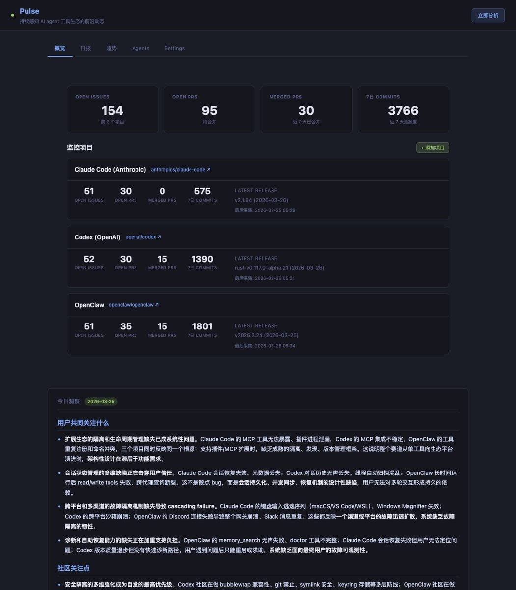

# Pulse — 持续感知 AI 前沿动态

今天做了一个开源项目：**Pulse**。

一句话概括：自动监控 AI agent 工具生态里最活跃的开源项目，每天告诉你——用户在要什么、社区在做什么、官方在往哪走。

## 为什么做这个？

AI agent 赛道变化太快。Claude Code、Codex、OpenClaw 这些项目每天都有大量的 issues、PRs、commits。光看 release notes 已经跟不上了——真正的信号藏在那些还没发布的分支 commits 里、藏在用户反复提的 feature request 里、藏在社区贡献者自己动手修的 bug 里。

Pulse 做的事情就是：把这些散落在 GitHub 各处的信号自动采集回来，用 4 个独立的 AI 分析师从不同角度解读，最后合成一份每日洞察报告。

## 怎么工作的？

**采集层**：用 GitHub CLI 自动拉取 issues、PRs、所有分支的 commits、releases。

**分析层**：4 个 AI 分析师并行工作——

- 用户研究分析师：看 issues，提炼用户痛点
- 社区生态分析师：看 PRs，发现社区关注方向
- 工程方向分析师：看 commits + merged PRs，判断官方工作重心
- 战略综合分析师：把前三者的发现提炼成趋势洞察

**展示层**：Web Dashboard + CLI + WebSocket 实时通知。

## 项目地址

**GitHub**: https://github.com/hchen13/pulse

默认监控三个项目：Claude Code、Codex、OpenClaw。可以随时添加更多。

开源，MIT 协议。欢迎 star。

